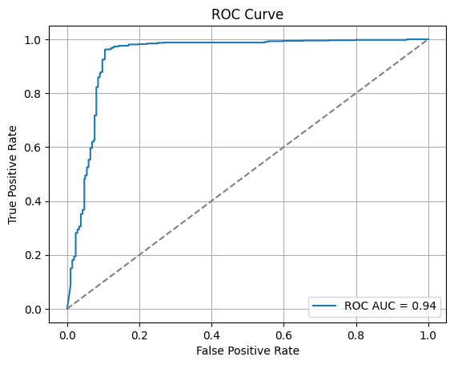
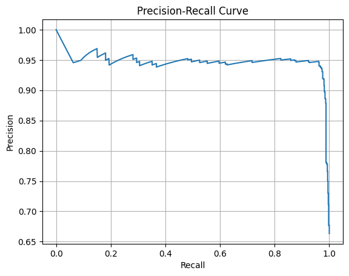
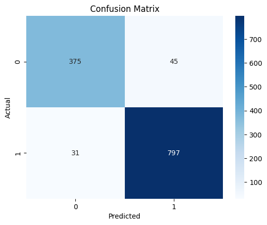
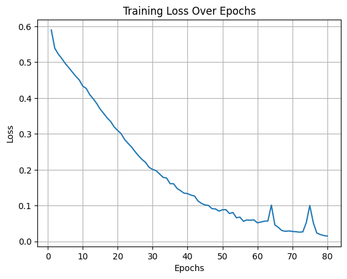

# Identification of Essential Proteins of Cancer Using Deep Learning

## Overview

This project focuses on the identification of **essential proteins related to cancer** using deep learning techniques. The approach combines sequence-based features, entropy metrics, and protein-protein interaction network analysis to classify whether a given protein plays a crucial role in cancer development.

---

## Workflow Summary

1. **Input**: UniProt ID of a human protein
2. **Feature Extraction**:
   - Sequence-based and physicochemical features using **Pfeature**
   - Shannon entropy and residue-wise entropy
   - Centrality features from interaction networks
3. **Modeling**: Deep learning classification using **TensorFlow/Keras**
4. **Prediction Output**:
   - Label: Essential (1) or Non-essential (0)
   - If essential, retrieves related drugs and supporting web links

---

## Feature Extraction

- **Tool Used**: [Pfeature](https://webs.iiitd.edu.in/raghava/pfeature/)
- **Features Extracted**:
  - Amino Acid Composition
  - Physicochemical Properties
  - Shannon Entropy
  - Shannon Entropy by Residue
  - Network Centrality Measures:
    - Degree Centrality
    - Betweenness Centrality
    - Closeness Centrality
    - Eigenvector Centrality

---

## Network Analysis Tools

Instead of NetworkX, we used Cytoscape-based tools:

- **Cytoscape**: Visualization and network management
- **CytoNCA**: For centrality calculations
- **StringApp**: To import interaction data from the STRING database

---

## Model Architecture

- Framework: TensorFlow/PyTorch
- Optimizer: **Adam**
- Loss Function: Binary Crossentropy
- Metrics: Accuracy, AUC-ROC

---

## Evaluation Metrics

- **Confusion Matrix**:
  - TP (True Positives)
  - FP (False Positives)
  - TN (True Negatives)
  - FN (False Negatives)
- **ROC Curve**: Receiver Operating Characteristic
- **AUC**: Area Under Curve
- **False Positive Rate**
- **Precision**, **Recall**, **F1 Score**

---
## 📊 Model Visualizations

### 1. ROC Curve

### 2. Precision-Recall Curve

### 3. Confusion Matrix

### 4. Loss vs Epochs

---
## Why These Features?

These features were chosen based on biological significance and computational relevance:

- **Sequence-based features** capture amino acid patterns
- **Shannon entropy** reflects sequence complexity
- **Centrality metrics** represent the protein’s role in interaction networks
- These factors are critical in determining protein essentiality in cancer pathways

---

## How Shannon Entropy Helps

Shannon entropy measures the randomness in a protein sequence. Proteins with high entropy may have diverse functional regions, suggesting essential biological roles. Residue-wise entropy helps to pinpoint variability at specific positions in the sequence.

---

## Tools and Libraries Used

- Python
- TensorFlow / Keras
- Pfeature
- Cytoscape + CytoNCA + StringApp
- Pandas, NumPy, Scikit-learn
- Matplotlib / Seaborn (for visualization)

---

## Future Directions

- Expand dataset with more diverse cancer types  
- Integrate 3D structural and expression data  
- Add interpretability tools to explain model predictions  
- Link predictions with clinical drug response data

---

